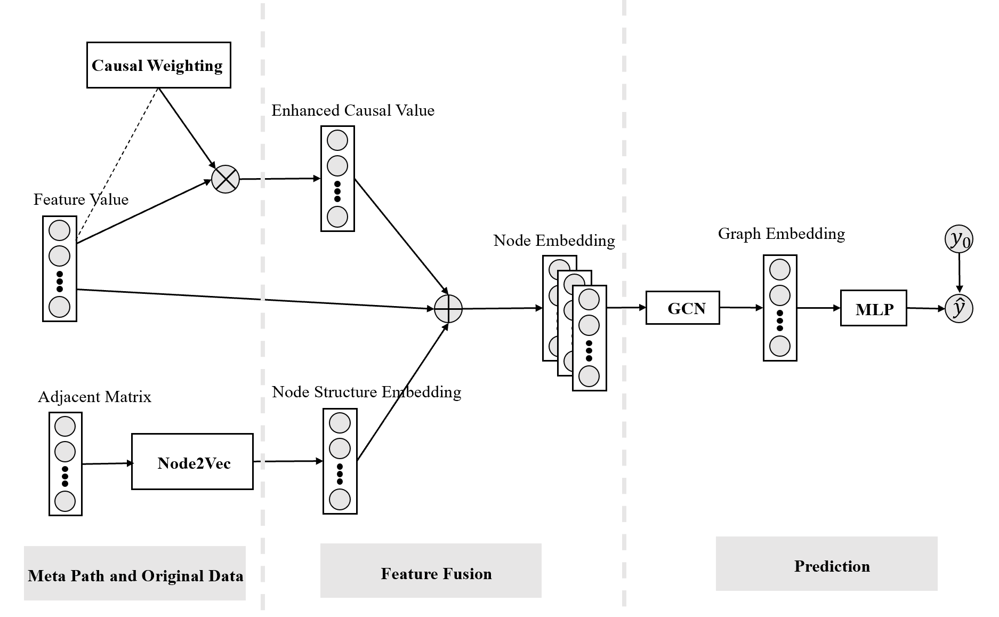
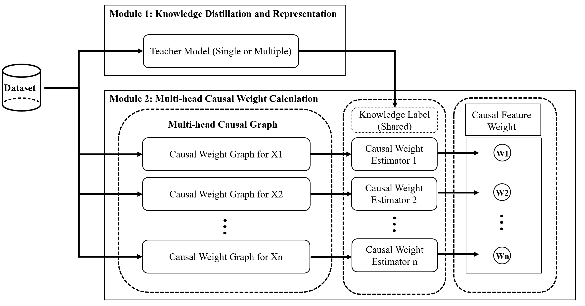

# Graph Neural Network with Causal Knowledge
This is the code implementation for the paper Uplift Modeling based on Graph Neural Network Combined with Causal Weighting

<!-- ABOUT THE PAPER -->
<h2 id="about-the-paper"> :pen: About The Paper</h2>
Uplift Modelling is a bridge between Causal Inference, Machine Learning and Personalization.
Graph Neural Network with Causal Inference

GNN Uplift Modeling Workflow  

  

Causal Weighting Workflow  

  

## Dataset
[criteo-uplift-v2.1.csv](https://1drv.ms/u/s!AuZMIQsKXGynq4lSIGaY3wZGUHBXXQ?e=lM9pAm)

## Prerequisites

  

<!--This project is written in Python programming language.  -->
The following are the major open source packages utilised in this project:

* DoWhy
* Gensim
* EconML
* CausalMML
* PyTorch Geometric

<h2 id="folder-structure"> Folder Structure</h2>

      .  
      ├── notebooks                                                       
      │    ├── 0_ate_weighting.ipynb                  
      │    ├── 1_feature_correlations_BNEstimator.ipynb   
      │    ├── 2_node_embeddings.ipynb
      │    ├── 3_causal_weighting_embedding(10d)_ate(13d).ipynb 
      │    ├── 3_causal_without_memory.ipynb
      │    └── README.md  
      │
      ├── synthetic                       # synthetic experiments
      │    ├── synthetic_data
      │    │    ├── data.csv              # synthetic dataset with 5 confounders
      │    │    ├── data_10000_9.csv      # synthetic dataset with 9 confounders
      │    │    ├── data_10000_20.csv     # synthetic dataset with 20 confounders
      │    │    └── README.md 
      │    │
      │    ├── synthetic_results
      │    │      ├── data_10000_x5       # folder containing detailed uplift modelling for synthetic dataset with 5 confounders
      │    │      ├── data_10000_x9       # folder containing detailed uplift modelling for synthetic dataset with 9 confounders
      │    │      ├── data_10000_x20      # folder containing detailed uplift modelling for synthetic dataset with 20 confounders
      │    │      └── README.md 
      │    │      
      │    └── README.md
      │
      │
      └── README.md

## 🎯 RoadMap

Follow [notebooks](./notebooks) in Google Colab 

## Future Work
Experiments on more benchmark datasets

Experiments to validate scalablility of this causal knowledge-enabled GNNs

## Contributing
If you have any questions or suggestions towards this repository, feel free to contact me at xy2119@ic.ac.uk.

Any kind of enhancement or contribution is welcomed!
